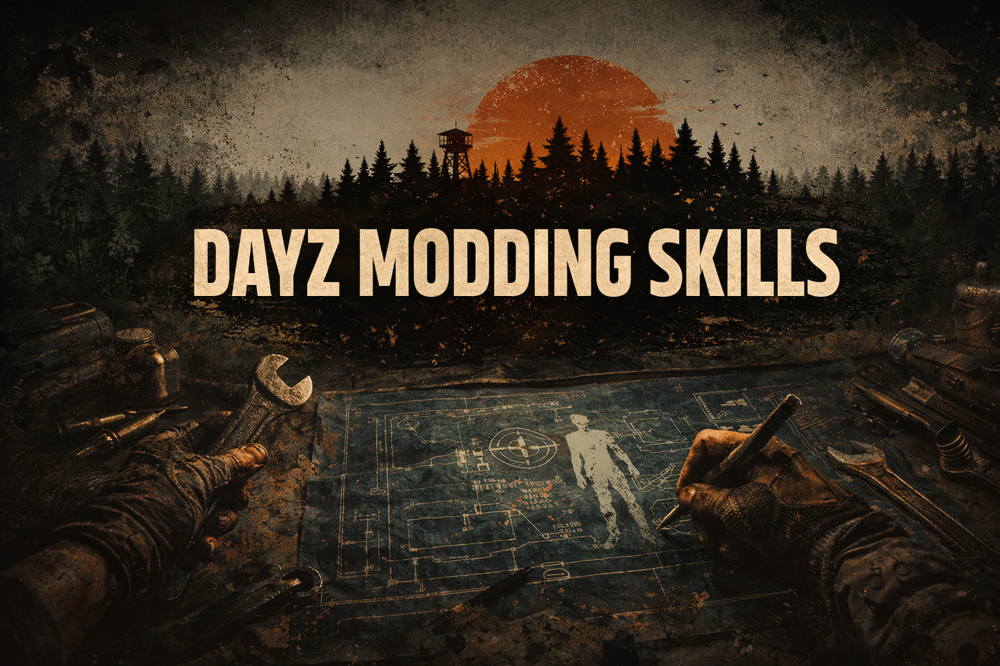

<h1 align="center">DayZ Modding Skill</h1>

<p align="center">
  
</p>

<p align="center">
  <strong>Make AI agents experts at developing DayZ mods in Enforce Script.</strong>
</p>

<p align="center">
  <a href="https://agentskills.io"></a>
  
  
  
</p>

---

An [Agent Skill](https://agentskills.io) that gives AI coding agents deep knowledge of DayZ modding — Enforce Script language rules, engine API patterns, mod architecture, performance optimization, and professional UI patterns extracted from 10+ production mods.

## What This Skill Does

When installed, your AI agent will:

- **Know Enforce Script is NOT C/C++** — and avoid all 30+ gotchas that trip up every AI
- **Write correct DayZ code** — proper `Class.CastTo()`, `JsonFileLoader` usage, memory management
- **Follow the layer hierarchy** — 3_Game / 4_World / 5_Mission compilation order
- **Use professional patterns** — singletons, RPC networking, modded classes, config persistence
- **Optimize for performance** — widget pooling, batched processing, caching, debouncing
- **Build production UI** — COT Module-Form-Window, CanvasWidget overlays, RichTextWidget
- **Consult the wiki** — fetches chapters from the [DayZ Modding Wiki](https://github.com/StarDZ-Team/DayZ-Modding-Wiki) (92 chapters, 12 languages) when it needs deeper info

## Install

### Via skills.sh
```bash
npx skills add StarDZ-Team/Dayz-Modding-Skills
```

### Via Claude Code
```bash
/plugin marketplace add StarDZ-Team/Dayz-Modding-Skills
```

### Manual (any agent)
Copy the `skills/dayz-modding/` folder to your agent's skills directory.

## What's Inside

```
skills/dayz-modding/
├── SKILL.md                              # Core: Iron Rules, workflow, debugging, code review
└── references/
    ├── enforce-script-reference.md       # Complete language reference + 18 gotchas
    ├── api-patterns.md                   # Entity, RPC, I/O, GUI, timers, player, actions
    ├── architecture.md                   # Layers, singletons, CF modules, events, permissions
    ├── development-workflow.md           # Systematic workflow: plan, code, verify, debug
    ├── advanced-patterns.md              # Performance, troubleshooting, debug commands, input
    └── gui-patterns.md                   # COT, VPP, CanvasWidget, RichText, MapWidget
```

**3,940+ lines** of curated DayZ modding knowledge covering:

| Area | Content |
|------|---------|
| Enforce Script Language | 7 types, 3 collections, classes, modded classes, memory (ARC), 30+ gotchas |
| Engine API | Entity system, RPC networking, file I/O, GUI widgets, timers, player, missions, weather, sound, actions |
| Mod Architecture | 5-layer hierarchy, config.cpp, server/client split, singletons, CF modules, events, permissions |
| Performance | Lazy loading, batched processing, widget pooling, debouncing, caching, vehicle registry |
| Professional UI | COT Module-Form-Window, UIActionManager factory, CanvasWidget/ESP, RichTextWidget, MapWidget, VPP windows |
| Troubleshooting | 3 diagnostic flowcharts, error message table, debug commands, launch parameters |
| Workflow | Plan before code, defensive coding protocol, build & verify, systematic debugging |

## Knowledge Source

This skill was built by studying:

- **2,800+ vanilla DayZ script files** reverse-engineered
- **10+ professional mods** analyzed (COT, VPP, Expansion, Dabs Framework, CF, DayZ Editor)
- **15 official Bohemia samples** documented
- **92-chapter wiki** distilled into actionable patterns

Full documentation available at the [DayZ Modding Wiki](https://github.com/StarDZ-Team/DayZ-Modding-Wiki).

## Compatible Agents

This skill follows the [Agent Skills](https://agentskills.io) open standard and works with:

Claude Code, Cursor, VS Code Copilot, Gemini CLI, OpenAI Codex, Roo Code, Goose, OpenCode, OpenHands, Junie, Amp, and [30+ more](https://agentskills.io).

## License

MIT - Use freely in your projects.

---

Built by the [StarDZ Team](https://github.com/StarDZ-Team) with the DayZ modding community.
